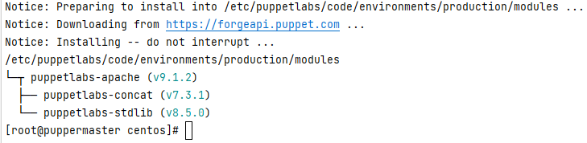

# First manifests

## Manifest
Manifests allow us to save code into scripts with an extension of .pp  
Manifests can be applied locally with ```puppet apply```
For full automation manifests need to be stored on the server  
in the correct environment.  
The default environment is production.  
```shell
# binary is at /opt/puppetlabs/bin
puppet config print
puppet config print config
puppet config print manifest --section master --environment production 
vi /etc/puppetlabs/code/environments/production/manifests/site.pp
``` 

### Simple message 
Ajouter un simple message 
```puppet
notify {'message':
  name => 'my message',
  message => 'Hello webforce 3 groupe',
}
```
All files are processed in alphabetical order
les commandes suivantes fournissent un resultat identique.

```shell
puppet apply /etc/puppetlabs/code/environments/production/manifests/site.pp
puppet agent -t
```

### Chaine de carateres avec simple quote et double quotes et variables
```puppet
notify {"FqdnTest":
  message => 'mon fqdn est ${::fqdn}', # With single-quote variables are not converted into value 
}
```
Avec des double-quotes

```puppet
notify {'FqdnTest':
  message => "mon fqdn est ${::fqdn}", # Top-level variable from facter resources
}
```
Facter est un programme qui retourne les caracteristiques du host dans des variables Puppet
```shell
facter processors
facter processors.isa
facter --json os.name os.release.major processors.isa
```

### Variable
```puppet

$todo = "Test"
notify {'Test':
  message => "la variable est = ${todo}", # display local variable 
}
```
#### Type de Variables
$redis_package_name = 'redis'   # String  
$install_java = true            # Boolean  
$dns_servers = [ '8.8.8.8' , '8.8.4.4' ]   # Array  
$config_hash = { user => 'joe', group => 'admin' }  # Hash  

### Idempotence 
Creer un user alice   
```shell
sudo useradd alice
```
et nous executons une autre fois la meme commande   
```shell
sudo useradd alice 
```
Nous avons un message de warning       
Alors qu'avec une maniere declarative comme le langage DSL Puppet  
soit le script est execute, soit il est ignore
```puppet
user { 'paul': 
  ensure => 'present',
}
```
Executez le script une deuxieme fois, il n'y a pas de message. 
Ensuite un exemple avec creation de la home directory du user
```puppet
user { 'mcfakey':
    ensure     => 'present',
    managehome => true,
}
```

### Quelques Puppet resources natives

Mettre une limite temps pour les mots de passe
```puppet
user { 'fusco':
  ensure           => 'present',
  # ATTENTION utilisation de single quotes pour arreter le caracter $ d'evaluation des variables
  password         => '$6$LD5snipgNY1',
  password_max_age => 30,
}
```
Verification de la date d'expiration
```shell
chage -l fusco 
```

```puppet
# create a directory
  file { '/tmp/site-conf':
    ensure => 'directory',
  }

  # a fuller example, including permissions and ownership
  file { '/tmp/admin-app-log':
    ensure => directory,
    owner  => 'root',
    group  => 'root',
    mode   => '0750',
  }

```
Symbolique link 
```puppet
file { '/tmp/link-to-motd':
    ensure => link,
    target => '/etc/motd',
  }
```

Ajouter un fichier s'il est absent, mais ne le met pas a jour s'il est change manuellement
```puppet
file { '/tmp/hello-file':
  ensure  => file,
  replace => 'no', # importante propriete
  content => "From Puppet\n",
  mode    => '0644',
}
```

###  Install apache module
```shell
puppet module install puppetlabs/apache 
```



## Execute the module
```shell
puppet apply -e 'include apache' # install apache
ss -nltp  # Check the port 80
curl localhost # Check the contents
```

## Exercice 1
Créez un fichier site.pp qui me permet de créer un dossier /tmp/test sur mes deux containers

go to FILE_LINE.md

