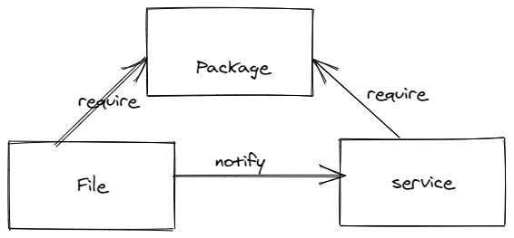

# Le code dsl
La relation entre le package et le service  est un élément important et
puissant paradigme de Puppet. L'ajout d'un type de ressource supplémentaire dans le code de
de puppet se nomme le trifecta. Presque toutes les tâches d'administration système tournent autour
ces trois types de ressources. 
En tant qu'administrateur système, vous installez un package, configurez le package avec les fichiers, 
puis démarrez le service.

