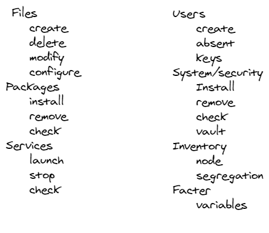

# Puppet Common Usage 




## Files
### Create file 
see examples in FIRST_MANIFESTS.md line 109-139
### Delete
see examples in FIRST_MANIFESTS.md  line 109-139

### Modify
see examples in FILE_LINE.md
#### Know more
File is backed up before being replaced.  
```puppet
class essai::example (
  Stdlib::Absolutepath $file = '/tmp/puppet-example',
  String[1] $content = 'Hello World with backup!',
) {
  file { $file:
    ensure  => file,
    owner   => 'root',
    group   => 'root',
    mode    => '0644',
    content => $content,
    backup => '.bck',
  }
}
```
### Configure 
See examples in TEMPLATES.md  

## Packages

### Install rehan git package from puppetlabs
```puppet
cd /etc/puppetlabs/code/environments/production/modules # directory production
puppet module install rehan-git # install module
ls -alrt # Check 
```
#### Code Analysis
```shell
cd /etc/puppetlabs/code/environments/production/modules/git/manifests
```
Edit the init.pp file , this is the code module entry file 
```puppet
# Class: git
# 
class git (
# parameters  
Boolean $sources_manage, 
String  $sources_repo,
String  $sources_ensure,
Boolean $package_manage,
String  $package_ensure,
String  $package_name,
# Hash type  
Hash    $users = lookup('git::users', Hash, 'hash', {}), # hash on the list of user involved with git
) {
anchor { "${module_name}::begin": }
-> class { "${module_name}::sources": }
-> class { "${module_name}::install": }
-> class { "${module_name}::config": }
-> anchor { "${module_name}::end": }
}
```
Run on puppetmaster     
Run on target1  
Troubleshooting

### TP 

### Install pre-requisite 
```shell
:
```


