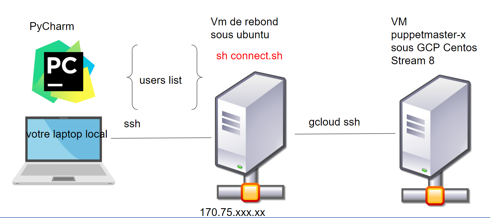

# Puppet Server on Centos8

## See Network Topology



<span style="color:red">if you are using Ubuntu 20.04 **go to USING_UBUNTU.md file**</span>

## Install centos stream 8 et puppet repo package
```shell
hostnamectl # Check your os
curl 'http://mirror.centos.org/centos/8-stream/BaseOS/x86_64/os/Packages/centos-gpg-keys-8-3.el8.noarch.rpm' --output key.rpm # initialize repo
sudo rpm -i key.rpm 
sudo dnf -y --disablerepo '*' --enablerepo=extras swap centos-linux-repos centos-stream-repos
sudo yum -y update
sudo dnf -y install https://dl.fedoraproject.org/pub/epel/epel-release-latest-8.noarch.rpm # install extra packages repo
sudo yum -y update # register your new repo
sudo yum -y install htop  iotop iftop # install htop for checking your vm
htop  # Ctrl-c to get out 
sudo rpm -Uvh https://yum.puppet.com/puppet7-release-el-8.noarch.rpm # install puppet repo package
sudo yum list  --disablerepo '*' --enablerepo=puppet7 available
yum list puppet*  # list all packages related to puppet
sudo yum install -y puppetserver # install puppetserver and puppet agent in  a same time
```

## Install Server and Agent 
```shell
sudo -s  # switch to superuser
cat /etc/hosts   # get all host defined for this vm 
echo "127.0.0.2 puppet" >> /etc/hosts  # add a host named puppet
!c   # rerun  cat command 
/opt/puppetlabs/puppet/bin/puppet --version  # get puppet agent version
grep ARGS /etc/sysconfig/puppetserver  # Get puppetserver memory parameters
grep 2g /etc/sysconfig/puppetserver  # Return one line
sed -i 's/2g/1g/g' /etc/sysconfig/puppetserver  # replace 1g 
grep 1g /etc/sysconfig/puppetserver   # Check  
systemctl start puppetserver # start puppetserver service 
systemctl status puppetserver # Check 
ss -ntl # Check whether the port 8140 is opened
ss -ntlp # parameter p add more info and display the name of the application which has opened the port
```

## Generate a CA on server
```shell
/opt/puppetlabs/bin/puppetserver ca list -a # list all current certificats
```


go to FIRST_MANIFESTS.md  
