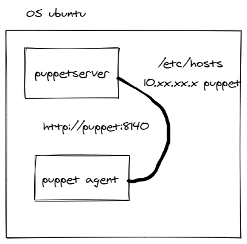

# Puppet on Ubuntu

## Gateway host to GCP

```shell
# ssh to gateway host provided 
sh connect.sh
# check the prompt
```

## Install PuppetServer and Agent in the same time
```shell
sudo apt-get update -y   # update repo link
#wget https://apt.puppetlabs.com/puppet8-release-noble.deb  # install puppet relevant packages
#sudo dpkg -i puppet8-release-noble.deb  # apply puppet package on your VM
#sudo apt-get update -y  # update os ubuntu again 
sudo apt-get install puppetserver -y # install puppet server and agent in the same time
sudo tac /etc/default/puppetserver # reverse edit of puppetserver configuration 
# commands for changing puppetserver memory footprint
sudo grep ARGS /etc/default/puppetserver  # Get puppetserver memory parameters
sudo grep 1g /etc/default/puppetserver  # Return one line
sudo sed -i 's/1g/2g/g' /etc/default/puppetserver  # replace 1g memory usage 
sudo grep 2g /etc/default/puppetserver   # Check  
sudo systemctl start puppetserver  # start the service
sudo systemctl enable puppetserver # set symbolic link for starting up puppetserver when rebooting the VM
sudo systemctl status puppetserver  # check service status
```
## Schema



## Adding a DNS entry
```shell
# set up puppet host with the internal IP address
vi /etc/hosts
# check 
<internal ip_address> puppet  
# check
ping -c 3 puppet # Test ping
puppet agent -t  # Check if it's work fine
```

## List of Certificates Authority on server
```shell
puppetserver ca list -a # list all current certificats
puppetserver ca sign --all # sign all certificats

```
<span style="color:red">if  Docker is installed  **go to CONTAINERS.md file**</span>  
**Go to DOCKER_UBUNTU.md**